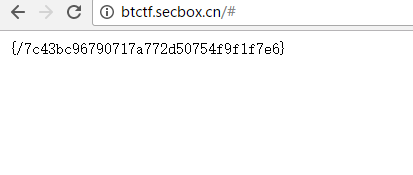

360补天成都站CTF Write-up
===================================
###补天成都沙龙现场的一道CTF题，题目之长，脑洞之大，超乎想象ORZ，其实并没有做完，只差最后一步。但鉴于没人做出来我还是写写writeup吧= =
###[URL](http://btctf.secbox.cn/)
- - -
####Part 1

首先映入眼帘的是这玩意。一开始以为是SQL注入，拿SQLMAP跑了半天，未果。翻了一下robots.txt

/passwd和/cgi-bin都不存在，所以思路还是不对。猜测可能有备份文件，于是尝试了尝试**index.php~,.index.php.swp, index.php.swp, index.php.bak**，未果，GG

狗头爷爷发现目录下存在m这个文件夹，然而被403，于是尝试继续对目录进行爆破，最后发现**/m/x/n/y**这个文件目录

然而对目录下进行文件名猜解并没有任何结果，还是GG

这时出题人提示是PHP弱类型，首先尝试了传入数组：user[]/password[]，没什么卵用；又试了MD5绕过，密码输入'QNKCDZO'还是不行，气氛变得十分gay尬。出题人于是在微信群里把源码放出来了，一看到源码我TM惊了

	<?php
	$flag = '{下一关地址}';
	$name = $_POST['name'];
	$pass = encode($_POST['pass']);

	$admin_user = "admin";
	$admin_pw = get_hash("0e260265122865008095838959784793");

	if ($name == $admin_user && $pass == $admin_pw){
	   echo $flag;
	}else{
	  echo "Guess it ?";
	}
	function get_hash($hash) {
	    return preg_replace("/[^0-9a-f]/","",$hash);
	}

	function encode($str) {
	    return get_hash(md5(md5($str) . "SALT"));
	}
	?>

这TM其实是源码审计题吧?!两次MD5加密还加了SALT不给源码谁能想得到啊ORZ

有了源码之后，很容易就能看出来，用户名是admin，而密码在**md5(md5($str) . "SALT")**加密后要等于'0e260265122865008095838959784793',然而因为PHP弱类型的关系，只需要让前两位等于'0e',其余所有位都为数字即可，遂用python开始爆破

    # -*- coding: utf-8 -*-
    import hashlib
    def md5(input):
        m = hashlib.md5()
        m.update(input)
        return m.hexdigest()
    list=[]
    for j in range(0,10):
        list.append(str(j))
    for i in range(0,1000000000):
        i=str(i).encode('utf-8')
       
        st=md5((md5(i)+'SALT').encode('utf-8'))
        if st[0:2]=='0e':
            if set(st[2:]).issubset(set(list)):
                print(i)
                print(st)
                # break

结果是62778807 用户名输入admin，密码输入62778807即可登陆

####Part 2
- - -
进去之后发现给了一个目录，访问后看到了这个玩意：

源码中发现tips:tieba/机器人

一开始还以为服务器上部署了贴吧机器人，后来才发现原来是社工题……直接去贴吧搜索muhe,前几条就发现了

####Part 3
- - -
给了个二维码，扫描一下，是个字符串：**A5I2A1824HD2U3355EB4V3795HH2D4M1580XX0564356155G315T**

苦思冥想都不得其解，想不到是什么加密方式。这时，出题人又给了个提示，搜索**"鸟叔英文名+二维码英文"** 于是百度**psy+qrcode** 发现一个软件Psytec QR Code Editor，似乎可以用来解密加密过的二维码

那就下载下来看看咯，结果提示说要输入密码。没办法，瞎猜吧，结果发现密码是butianctf

####Part 4（未完成）
- - -

这个目录好眼熟啊= =，这TM不就是我们一开始爆破出来的目录吗，神TM居然是个APK文件

下载下来发现是个并没什么卵用的APK，点了几个按钮都没什么卵用

唉，估计是个安卓逆向题，然而ET去上课了没来，只好瞎做了。先解包，发现assests目录下有个文件叫flag

打开发现是乱码。这时出题人又给了个HINT:是TEA加密，密钥在APK中。于是把DEX文件丢进dex2jar，然后在JDGUI下查看。在网上找了个TEA解密的C++源码，居然还要自己编译…… 先试了'flag'作为密钥发现不行，解不出东西;DEX里面有个'nothere'字符串，发现可以解密出一个新文件，然后想重打包。然后……狗头直接替换文件改后缀了……连签名都不签……然后……就没有然后了，时间到了ORZ

